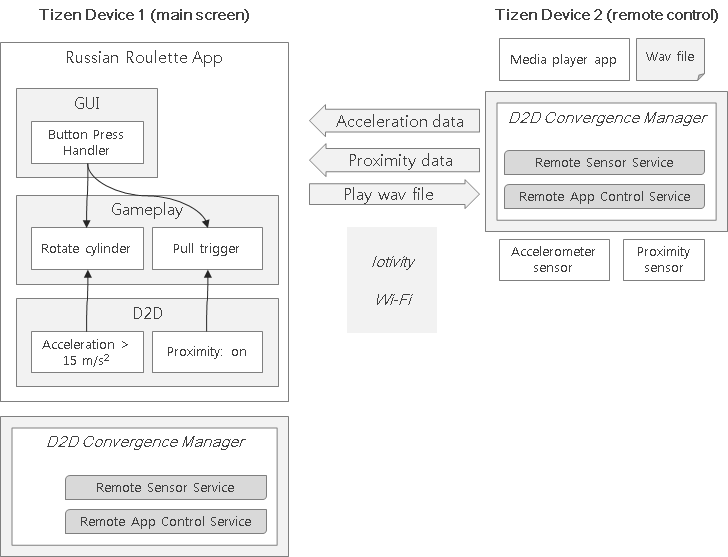

# tizen_russian_roulette
The Russian Roulette game for D2D and D2S environment

*Since Tizen 3.0*

## Overview

Russian roulette (Russian: Русская рулетка) is a lethal game of chance in which a player places a single round in a revolver, spins the cylinder, places the muzzle against their head, and pulls the trigger. "Russian" refers to the supposed country of origin, and roulette to the element of risk-taking and the spinning of the revolver's cylinder, which is reminiscent of a spinning roulette wheel.

[https://en.wikipedia.org/wiki/Russian_roulette](https://en.wikipedia.org/wiki/Russian_roulette)

## Installation

1. Install the app on a Tizen device, equipped with screen, for example, on
Tizen mobil phone or Tizen TV
2. Copy wav file *wav/cosmo.wav* folder to */home/owner/media/Sounds/* folder of
another Tizen device, equipped with acceleration and proximity sensors

## Gameplay

* After the app is started the user selects the game remote control from available
options. If no remote Tizen devices available, the user select "no remocon"
option and plays on a single local device.
* The user is present with a schematic view of a Nagant revolver, which includes
a cylinder with six places for the bullets and a barrel. The top bullet place
corresponds to the gun barrel, while the selected place corresponds to the
position of the single bullet in the cylinder.
Initially the bullet is put into a random place, but the user can put it to an
arbitrary place.
* To rotate the cylinder the user should imitate the gesture of rotating the real
Nagant cylinder by shaking the remote control device actively. The successful
rotation is detected when the summary acceleration vector with module more than
15 m/s^2 is registered by acceleration sensor. Another way to rotate the
cylinder is to press the button on the bottom of the game screen.
The cylinder rotates for a random number of times which is indicated with
changing bullet position in the cylinder.
* To pull the trigger the user is required to imitate the action of placing the
muzzle against their head. The pulling happens when the proximity sensor
detects the closeness of the remote control device to the user head. Another way
to pull the trigger is to press the button on the bottom of the game screen.
If the bullet is not in the barrel, the user, luckily, can continue playing:
rotate the cylinder and pull the trigger as described above.
In the fatal case the remote device starts playing the annoying wav file right
into the user's ear: GAME OVER. The user is "dead" and not allowed to play
any more.

## Architecture

## Reference

* [Russian Roulette on Wikipedia](https://en.wikipedia.org/wiki/Russian_roulette)
* [Tizen Device Sensor Framework](https://developer.tizen.org/development/guides/native-application/location-and-sensors/device-sensors#lin_accelerometer)

## TODO
* Add automatic file transfer for sound file
* Design D2S scenario
* Add screen shots

## See also
[Command line Russian Roulette](https://www.nixcraft.com/lmao-command-line-russian-roulette-for-linux-and-unix-users/295/)
